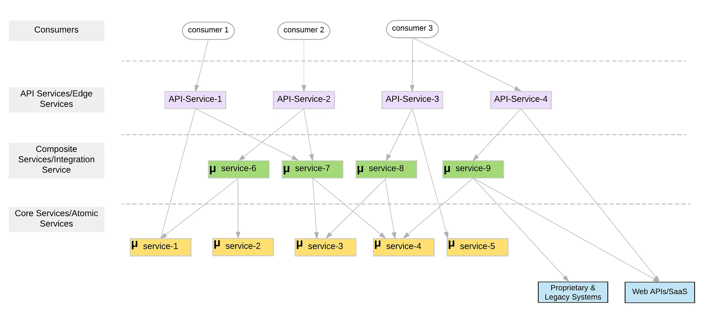

# Getting Started


## Architecture


| Service Name      | Role               | Purpose                                                                                                                                                                                                                                                                                                                                          | Port | Note |
|-------------------|--------------------|--------------------------------------------------------------------------------------------------------------------------------------------------------------------------------------------------------------------------------------------------------------------------------------------------------------------------------------------------|------|------|
| Eureka Server     | Service Resigistry | Eureka Server is a service registry that helps manage service discovery and registration in microservices architectures                                                                                                                                                                                                                          | 8761 |      |
| Composite Service | Composite Service  | Composite/integration services are coarse-grained(relative to atomic services), independent from each other and contains business logic(routing, what services to call, how to do data type mapping etc.) and network communication logic(inter-service communication through various protocols, resiliency behaviors such as circuit breakers). | 8080 |      |
| User Service      | Core Service       | fine-grained self-contained services (no external service dependencies)that mostly comprise of the business logic and less or no network communication logic                                                                                                                                                                                     | 8083 |      |
| Package Servuce   | Core Service       | fine-grained self-contained services (no external service dependencies) that mostly comprise of the business logic and less or no network communication logic                                                                                                                                                                                    | 8082 |      |

**Illustration of Core Service and Composite Service**



## Tech Stack

+ Spring Cloud Open Feign
+ Spring Cloud Netflix Eureka
+ Resilience4j
+ Spring Actuator
+ Spring Boot 3
+ Spring AOP


## Common Q & A 
Q: When A calls B from `OpenFeign`, No servers available for service: B-SERVICE

S: A `application.yaml` should have fetch-registry true.
```yaml
eureka:
  client:
    register-with-eureka: true
    fetch-registry: true
```

Q: `404` when includes path variable, `[{"timestamp":"2024-06-02T03:45:41.829+00:00","status":404,"error":"Not Found","path":"/users/"}]]`


S: It is due to path variable is `null`.  Instead of following
```json

{
    "user_id":"1",
    "package_name": "amazon delivery",
    "package_vendor": "usps"
}
```
We need to use following since we did not set json properties to change name
```json
{
    "user_id":"1",
    "package_name": "amazon delivery",
    "package_vendor": "usps"
}
```
Reference: 
> Hello Folks,
Today I faced the same issue and i found the solution.
The problem with my code snippet was,have passed null value for ID attribute.
public String getId(@PathVariable("id") long id)
so while making the feign request, url path variable attribute is not getting replaced with pathVariable(ID) rather then replacing the actual id value.
When id as null -> http://SomeService/{id}
When id as proper value -> id = 123 ->http://SomeService/123.
Correct me, if am wrong @spencergibb
Thanks


Q: Why does my eureka service auto shutdown during application startup?

A: Check miss `spring-boot-starter-web` dependency. Add this into `pom.xml`

Reference:
+ https://blog.csdn.net/CodeFarmer_/article/details/80592388
+ https://github.com/spring-cloud/spring-cloud-netflix/issues/2696

