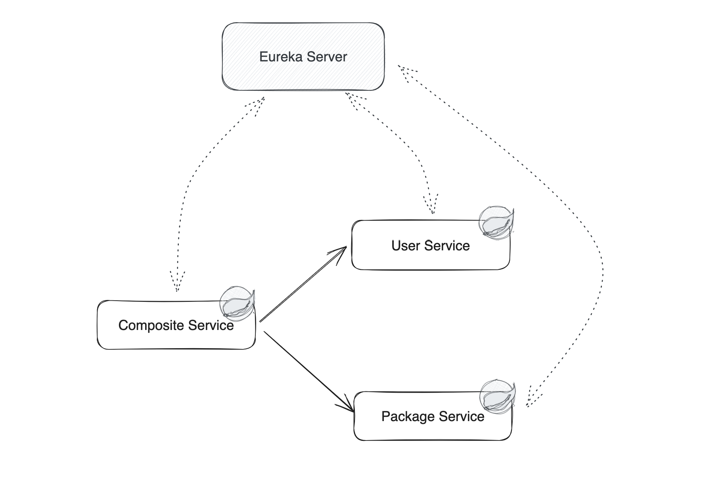
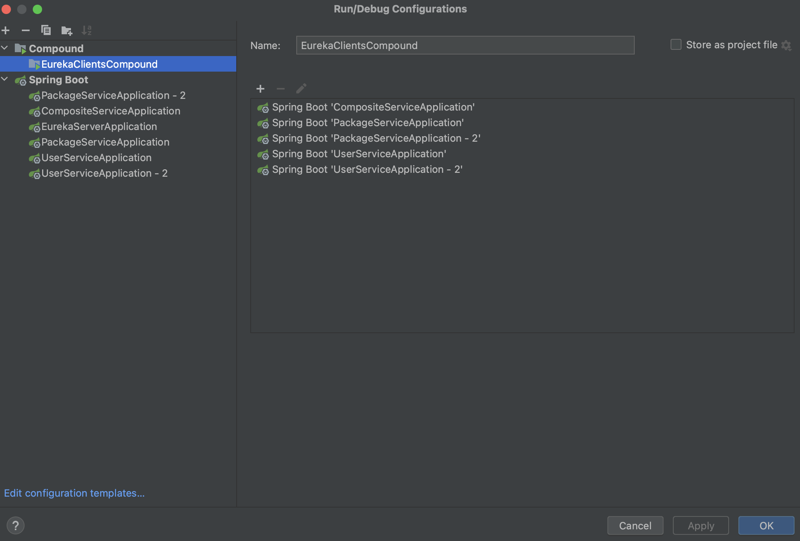
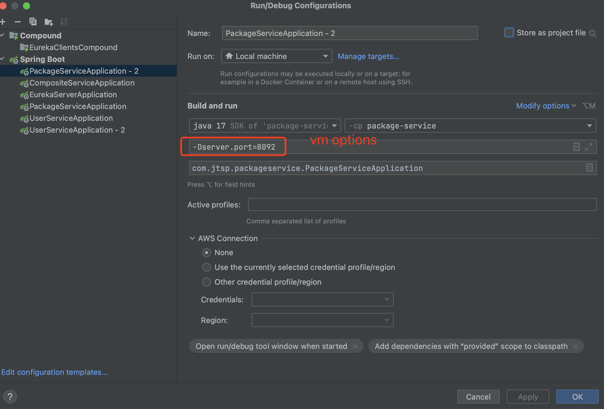

# Getting Started


## Architecture


| Service Name      | Role              | Purpose                                                                                                                                                                                                                                                                                                                                          | Port | Note |
|-------------------|-------------------|--------------------------------------------------------------------------------------------------------------------------------------------------------------------------------------------------------------------------------------------------------------------------------------------------------------------------------------------------|------|------|
| Eureka Server     | Service Registry  | Eureka Server is a service registry that helps manage service discovery and registration in microservices architectures                                                                                                                                                                                                                          | 8761 |      |
| Composite Service | Composite Service | Composite/integration services are coarse-grained(relative to atomic services), independent from each other and contains business logic(routing, what services to call, how to do data type mapping etc.) and network communication logic(inter-service communication through various protocols, resiliency behaviors such as circuit breakers). | 8080 |      |
| User Service      | Core Service      | fine-grained self-contained services (no external service dependencies)that mostly comprise of the business logic and less or no network communication logic                                                                                                                                                                                     | 8083 |      |
| Package Service   | Core Service      | fine-grained self-contained services (no external service dependencies) that mostly comprise of the business logic and less or no network communication logic                                                                                                                                                                                    | 8082 |      |

**Illustration of Core Service and Composite Service**


## Tech Stack

+ Spring Cloud Open Feign
+ Spring Cloud Netflix Eureka
+ Resilience4j
+ Spring Actuator
+ Spring Boot 3
+ Spring AOP


## Resilience4j Config Explanation
```yaml
resilience4j:
  circuitbreaker:
    metrics:
      enabled: true
    configs:
      default:
        register-health-indicator: true
        sliding-window-size: 10
        minimum-number-of-calls: 5
        permitted-number-of-calls-in-half-open-state: 3
        automatic-transition-from-open-to-half-open-enabled: true
        wait-duration-in-open-state: 5s
        failure-rate-threshold: 50
        event-consumer-buffer-size: 10
```

**metrics.enabled**
Description: Enables the collection of metrics for the Circuit Breaker.
Value: true (Metrics are enabled).

**configs.default**
This section defines the default configuration for the Circuit Breaker. You can have multiple configurations, but here we're focusing on the default one.

**register-health-indicator**
+ Description: Registers a health indicator for the Circuit Breaker which can be used by monitoring systems to check the health status.
+ Value: true (Health indicator is registered).

**sliding-window-size**
+ Description: Defines the size of the sliding window which is used to record the outcome of calls.
+ Value: 10 (The last 10 calls are considered).

**minimum-number-of-calls**
+ Description: The minimum number of calls that must be made before the Circuit Breaker can calculate the failure rate.
+ Value: 5 (At least 5 calls must be made).

**permitted-number-of-calls-in-half-open-state**
+ Description: The number of calls that are allowed when the Circuit Breaker is in the half-open state.
+ Value: 3 (Up to 3 calls are allowed to test if the external service has recovered).

**automatic-transition-from-open-to-half-open-enabled**
+ Description: Enables automatic transition from open to half-open state after the wait-duration-in-open-state has passed.
+ Value: true (Automatic transition is enabled).

**wait-duration-in-open-state**
+ Description: The time that the Circuit Breaker should wait before transitioning from open to half-open state.
+ Value: 5s (Wait for 5 seconds).

**failure-rate-threshold**
+ Description: The failure rate threshold above which the Circuit Breaker will open.
+ Value: 50 (If 50% or more of the calls fail, the Circuit Breaker opens).

**event-consumer-buffer-size**
+ Description: The size of the buffer for storing events (like state transitions and failed calls) for event consumers.
+ Value: 10 (Buffer can store up to 10 events).

Reference: https://resilience4j.readme.io/docs/circuitbreaker

## Optional: One Project, Many Spring Boot Instances
Click IntelliJ `Edit Run Config`, select `+` to add instances based on target main class

Reference: https://stackoverflow.com/questions/58348457/running-two-spring-boot-instances
Change the port in the `vm options` to avoid port conflict

## Common Q & A 
Q: When A calls B from `OpenFeign`, No servers available for service: B-SERVICE

S: A `application.yaml` should have fetch-registry true.
```yaml
eureka:
  client:
    register-with-eureka: true
    fetch-registry: true
```

Q: `404` when includes path variable, `[{"timestamp":"2024-06-02T03:45:41.829+00:00","status":404,"error":"Not Found","path":"/users/"}]]`


S: It is due to path variable is `null`.  Instead of following
```json

{
    "user_id":"1",
    "package_name": "amazon delivery",
    "package_vendor": "usps"
}
```
We need to use following since we did not set json properties to change name
```json
{
    "user_id":"1",
    "package_name": "amazon delivery",
    "package_vendor": "usps"
}
```
Reference: 
> Hello Folks,
Today I faced the same issue and I found the solution.
The problem with my code snippet was,have passed null value for ID attribute.
public String getId(@PathVariable("id") long id)
so while making the feign request, url path variable attribute is not getting replaced with pathVariable(ID) rather than replacing the actual id value.
When id as null -> http://SomeService/{id}
When id as proper value -> id = 123 ->http://SomeService/123.
Correct me, if am wrong @spencergibb
Thanks


Q: Why does my eureka service auto shutdown during application startup?

A: Check miss `spring-boot-starter-web` dependency. Add this into `pom.xml`

Reference:
+ https://blog.csdn.net/CodeFarmer_/article/details/80592388
+ https://github.com/spring-cloud/spring-cloud-netflix/issues/2696

